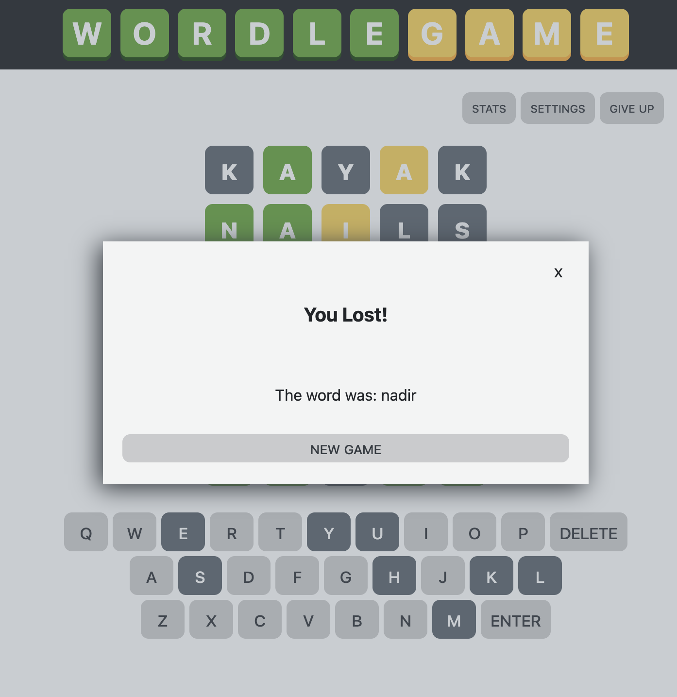

# WORDLE GAME REPLICA

A personal project based on the famous Wordle Web App Game [Wordle Web App Game](https://wordlegame.org/).


## Table of contents

- [Overview](#overview)
  - [The challenge](#the-challenge)
  - [Links](#links)
- [My process](#my-process)
  - [Built with](#built-with)
  - [What I learned](#what-i-learned)
- [Author](#author)

## Overview

### The challenge

Users should be able to:

- Guess a 5-letter word using the onscreen keyboard or physical keyboard
- See whether their guess was correct or incorrect
- See which letters are correct and in the right place, which are correct but placed wrong, and which do not belong all together
- See whether after 6 guesses they won or lost
- Track and see their game stats





### Links

- Live Site URL: [Add live site URL here](https://your-live-site-url.com)

## My process

### Built with

- Semantic HTML5 markup
- CSS custom properties
- Flexbox
- CSS Grid
- Mobile-first workflow
- Vanilla JavaScript
- REST API
- Client Side Storage

### What I learned

This project is special because it was one of the first projects in which I decided to leave tutorial hell and just attack a project all on my own. I was always fond of this game and decided to replicate it just based on playing it, reviewing it, and using my own problem-solving skills.

This project really allowed me to practice and hone in on developing the basic HTML, CSS, and Vanilla Javascript work-flow, tackle responsive design decisions & practices, and also implement javascript functions and working with JSON objects.

I initially started of by completing the entire project first by implementing the design and functionality of the game (ensuring users could type or select a letter and it would appear in the ui.) From there, I applied all the rules of the game to check whether a word guessed was correct or incorrect.

The first iteration of the project was completed using a list of simple words that I stored on the script js for simplification purposes. However, after futhering my knowledge with API's and data storage, I decided to take the project further and use a third-party API to fetch the "secret guess word" as well as use Client Side Storage to allow users to view their stats as they play the game.

An example of the game set up code in JS:

```js
function newGameSetUp() {
  //reset game screen
  document.querySelectorAll(".letterCell").forEach((item) => {
    item.textContent = "";
    item.classList.remove("active");
    item.classList.remove("correct");
    item.classList.remove("wrong");
    item.classList.remove("wrongPlacement");
  });
  playerStats = getLocalStorage("playerStats");
  //close out message
  exitMessage(3);
  //show beginning message
  startGameMessage.classList.remove("hidden");
  messageBox.classList.remove("hidden");
  //start new game
  return beginNewGame();
}
```

I really enjoyed creating this project and how it helped establish my comfort with JavaScript and implementing a project from scratch, beginning to end.

## Author

- Website - [Add your name here](https://www.your-site.com)
- LinkedIn - [@fperezfrancisco](https://www.linkedin.com/in/fperezfrancisco/)
